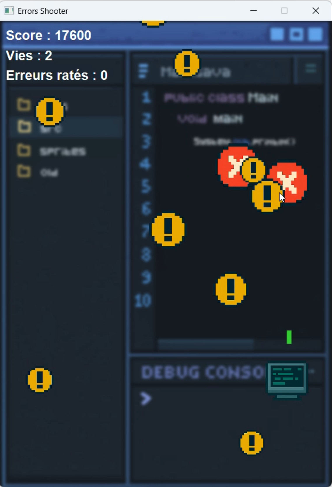

# Error Shooter

Un mini-jeu inspiré des _Space Shooters_ et des jeux de type _Tower Defense_, développé en Java avec JavaFX 17.  
Le joueur incarne un programmeur qui fait face à une horde d’erreurs et de warnings informatiques.  
Son but est de détruire les erreurs avant qu’il ne soit trop tard, tout en évitant de se faire toucher.

## Capture d'écran



## Contrôles

Les controles du jeu sont modifiable dans la classe `Controls`,
ci-dessous les controles par défaut.

| Action             | Touche par défaut |
| ------------------ | ----------------- |
| Déplacement gauche | Q                 |
| Déplacement droite | D                 |
| Déplacement haut   | Z                 |
| Déplacement bas    | S                 |
| Tirer              | ESPACE            |
| Rejouer            | ENTRÉE            |

## Lancer le jeu

### Prérequis

- Java 17 doit être installé sur votre machine.
- JavaFX 17 doit être téléchargé séparément.

### Étapes

1. Téléchargez [JavaFX SDK 17](https://gluonhq.com/products/javafx/) et extrayez-le dans un dossier de votre choix.
2. Téléchargez le fichier `ErrorShooter.jar` depuis la section [Releases](https://github.com/votre-utilisateur/ErrorShooter/releases) du dépôt GitHub.
3. Ouvrez un terminal ou une invite de commande dans le dossier contenant `ErrorShooter.jar`.
4. Exécutez la commande suivante (en remplaçant le chemin par celui vers votre JavaFX SDK) :

#### ▶️ Windows

```bash
java --module-path "\chemin\vers\javafx-sdk-17\lib" --add-modules javafx.controls,javafx.graphics -jar ErrorShooter.jar
```

#### 🐧 Linux / macOS

```bash
java --module-path /chemin/vers/javafx-sdk-17/lib --add-modules javafx.controls,javafx.graphics -jar ErrorShooter.jar
```

> Remplace `"chemin/vers/javafx-sdk-17/lib"` par le chemin réel où vous avez extrait JavaFX.
